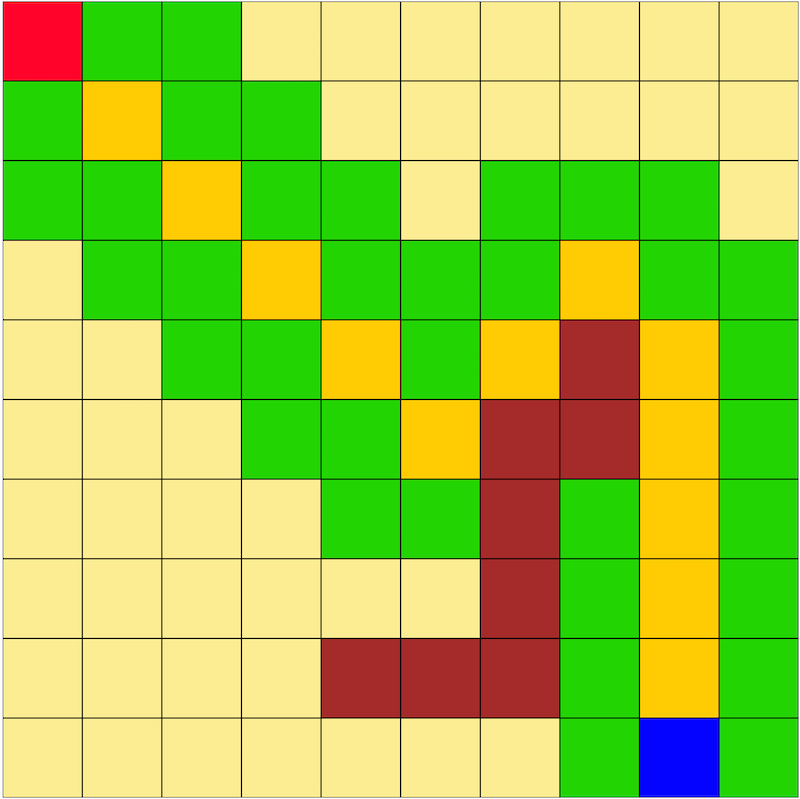

# A* (Astar)

## Environment 
	1. At least 10 x 10 positions
	2. Allowed movements: 
		1. Walk any 8 positions around the current position, if the block is free.
			-Coast = 
				- 1 for vertical and horizontal movements. 
				- 1.4 for diagonal movements.
 
	3. Input: 
		- Define `Start` and `Goal` positions.
		- Define `Walls` posisitions.
	

## Best path search
	1. A* algorithm
		- Obs.: heuristic function = Euclidean distance
	2. wA* Algorithm
	
## Run

- Run `index.html` file on Google Chrome web browser.

